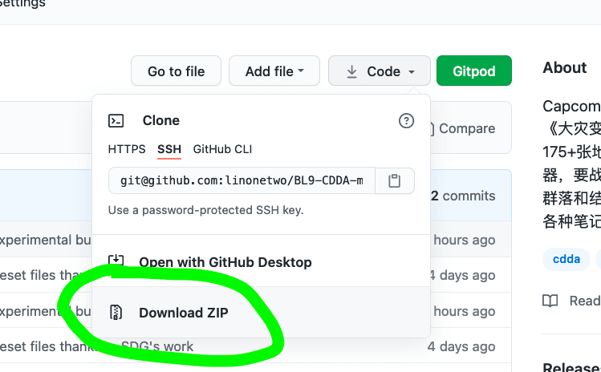

# Secronom-Zombies 魔鬼僵尸

**Axema's GREAT and LEGENDARY mod!My personally maintained and forked version**

Axema 的伟大传奇的 mod！目前由我个人（Kenan2000）维护和分叉的版本

**Link to Axema's version of Secronom - https://github.com/AxemaVales/Secronom-Zombies**

### How to install the mod:

最新版这样下：

1. Extract **Secronom-Zombies-master**.
2. Put the _secronom_ into the mod folder of CDDA.
3. Done. Enjoy the mod!

### How to update your existing mod:

1. Delete the _secronom_ mod from mod folder of CDDA.
2. Extract the latest **Secronom-Zombies-master**.
3. Put the _secronom_ mod into the mod folder of CDDA.
4. Done.

###### Do this everytime you update. It is done to avoid errors.

### What is the .zip file?

The _secronom.zip_ file contains the latest mod version's files that works for pre-nested experimental version of CDDA (build #10614). Note that this zip file has no tileset. Place the old tilesets in this version if you are about to use it.

### Additional info:

_Secronom_ mod folder has informational texts that might help you out...

## Discord Links
Discord servers the maintainer/author of this mod actively participates.

#### SomeDeadGuy's Server for Undead Schmucks
* https://discord.gg/M7MG7hnV5p

#### CDDA Modding Community
* https://discord.gg/PuMsXMPwaU
